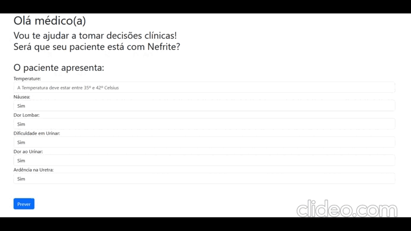

# Previsão de Nefrite

## Objetivo:
Produção de um modelo de machine learning, capaz de auxiliar médicos no diagnóstico de nefrite.

# Introdução
O lançamento do Chat Gpt popularizou e tornou evidente o poder do uso das inteligências artificiais no nosso cotidiano.

No campo da saúde, modelos de machine learning podem ajudar profissionais da saúde a tomar melhores decisões sobre o diagnóstico, diminuindo erros ou no tratamento, melhorando sua eficácia e engajamento do paciente à terapia.

## Metodologia:

O conjunto de dados utilizados foi a [inflamação aguda](https://archive.ics.uci.edu/dataset/184/acute+inflammations) disponível no UCU.

O algoritmo escolhido para treino foi o [Stacking Classifier](https://scikit-learn.org/stable/modules/generated/sklearn.ensemble.StackingClassifier.html), que utiliza o método de ensemble que utiliza previsões de modelos pré-treinados, para treinar um modelo final a escolha do cientista de dados.

A aplicação utilizou fast api como backend e o método de deploy foi docker.

## Resultado

O modelo mostrou acurácia e precisão de 100%. Acredito que seja devido ao baixo número de observações no conjunto de dados.

## Conclusão

O modelo mostrou-se eficaz em aprender o padrão do conjunto de dados, entretanto isso pode estar relacionado ao número baixo de observações.

Entretanto, acredito que esse experimento pode servir como base para projeto com um número maior de dados, tornando suas previsões mais seguros para auxiliar profissionais de saúde em decisões clínicas.

